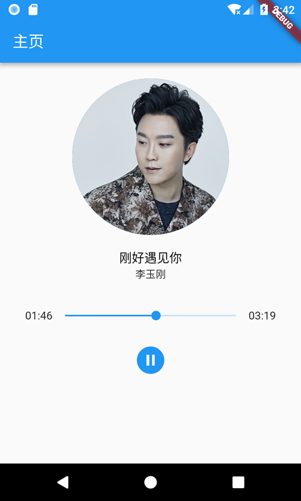

## 音乐播放
音乐播放可以使用 [audioplayer](https://github.com/rxlabz/audioplayer) 这个库，这是一个用于播放远程或本地音频文件的 Flutter 音频插件。


先安装依赖：

```js
dependencies:
  audioplayer: ^0.5.2
```

### 基本使用

在使用前先初始化一个实例。

```js
import 'package:audioplayer/audioplayer.dart';

AudioPlayer audioPlugin = new AudioPlayer();
```

之后，你可以通过以下的方法来控制音乐的播放情况。

```js
// 播放
Future<void> play() async {
    await audioPlayer.play(kUrl);
    setState(() => playerState = PlayerState.playing);
}
// 暂停
Future<void> pause() async {
    await audioPlayer.pause();
    setState(() => playerState = PlayerState.paused);
}
// 停止
Future<void> stop() async {
    await audioPlayer.stop();
    setState(() {
        playerState = PlayerState.stopped;
        position = new Duration();
    });
}
```

接着，你或许需要监听音乐的播放进度情况。

```js
// 监听播放的位置
_positionSubscription = audioPlayer.onAudioPositionChanged.listen(
    (p) => setState(() => position = p)
);

// 监听音乐播放的状态
_audioPlayerStateSubscription = audioPlayer.onPlayerStateChanged.listen((s) {
  if (s == AudioPlayerState.PLAYING) {
        setState(() => duration = audioPlayer.duration);
  }
  else if (s == AudioPlayerState.STOPPED) {
        onComplete();
        setState(() {
        position = duration;
        });
  }
}, onError: (msg) {
    setState(() {
        playerState = PlayerState.stopped;
        duration = new Duration(seconds: 0);
        position = new Duration(seconds: 0);
    });
});
```

### 使用示例

```js
import 'dart:async';

import 'package:flutter/material.dart';
import 'package:audioplayer/audioplayer.dart';

const mp3Url = 'http://fs.w.kugou.com/201901192158/369c7265b8fc2d30d4fe40f5f1f63e3c/G078/M08/18/17/jg0DAFgi6G-AKqsqADDP_nSW5F4051.mp3';
const imgUrl = 'http://singerimg.kugou.com/uploadpic/softhead/400/20181224/20181224183453372.jpg';

enum PlayerState { stopped, playing, paused }

class styles {
  static var h2 = TextStyle(fontSize: 16, color: Colors.black);
  static var p = TextStyle(fontSize: 13, color: Colors.black87);
}

class IndexView extends StatefulWidget {
  IndexView({Key key, this.title}) : super(key: key);
  final String title;
  @override
  IndexViewState createState() => IndexViewState();
}

class IndexViewState extends State<IndexView> {
  // 音乐长度
  Duration duration;
  // 播放位置
  Duration position;
  // 音乐实例
  AudioPlayer audioPlayer;
  // 初始播放暂停
  PlayerState playerState = PlayerState.stopped;
  get isPlaying => playerState == PlayerState.playing;
  get isPaused => playerState == PlayerState.paused || playerState == PlayerState.stopped;
  get positionText => position != null ? position.toString().split('.').first.substring(2) : '00:00';
  get durationText => duration != null ? duration.toString().split('.').first.substring(2) : '00:00';
  get positionVal => position != null ? position.inMicroseconds.toDouble() : 0.0;
  get durationVal => duration != null ? duration.inMicroseconds.toDouble() : 0.0;

  StreamSubscription positionSubscription;
  StreamSubscription playerStateSubscription;

  IconData getPlayIcon() {
    if (playerState == PlayerState.stopped) {
      return Icons.play_circle_filled;
    }
    if (playerState == PlayerState.paused) {
      return Icons.play_circle_filled;
    }
    return Icons.pause_circle_filled;
  }

  Future play() async {
    await audioPlayer.play(mp3Url);
    setState(() => playerState = PlayerState.playing);
  }

  Future pause() async {
    await audioPlayer.pause();
    setState(() => playerState = PlayerState.paused);
  }

  Future seek(seconds) async {
    await audioPlayer.seek(seconds);
  }

  // 初始化音乐播放器
  void initAudioPlayer() {
    audioPlayer = new AudioPlayer();

    positionSubscription = audioPlayer.onAudioPositionChanged.listen((p) => setState(() => position = p));
    playerStateSubscription = audioPlayer.onPlayerStateChanged.listen((s) {
      if (s == AudioPlayerState.PLAYING) {
        setState(() => duration = audioPlayer.duration);
      } else if (s == AudioPlayerState.STOPPED) {
        setState(() {
          position = duration;
          playerState = PlayerState.stopped;
        });
      }
    }, onError: (msg) {
      setState(() {
        playerState = PlayerState.stopped;
        duration = new Duration(seconds: 0);
        position = new Duration(seconds: 0);
      });
    });
  }

  void playTogger() {
    if (this.isPaused) {
      this.play();
    }
    if (this.isPlaying) {
      this.pause();
    }
  }

  @override
  void initState() {
    super.initState();
    initAudioPlayer();
  }

  @override
  void dispose() {
    super.dispose();
    positionSubscription.cancel();
    playerStateSubscription.cancel();
    audioPlayer.stop();
  }

  @override
  Widget build(BuildContext context) {
    return Scaffold(
      appBar: AppBar(title: Text(widget.title)),
      body: Container(
        padding: EdgeInsets.all(20),
        child: Center(
          child: Column(
            children: <Widget>[
              CircleAvatar(
                backgroundImage: NetworkImage(imgUrl),
                radius: 100.0, // --> 半径越大，图片越大
              ),
              Container(
                padding: EdgeInsets.all(16),
                child: Column(
                  children: <Widget>[
                    Text('刚好遇见你', style: styles.h2),
                    Text('李玉刚', style: styles.p),
                  ],
                ),
              ),
              Container(
                padding: EdgeInsets.all(12),
                child: Flex(
                  direction: Axis.horizontal,
                  children: <Widget>[
                    Text('$positionText'),
                    Expanded(
                      flex: 1,
                      child: new Slider(
                        value: positionVal,
                        max: durationVal,
                        min: 0.0,
                        activeColor: Colors.blue,
                        onChanged: (double val) {
                          this.seek(val / 1000 / 1000);
                        },
                      ),
                    ),
                    Text('$durationText'),
                  ],
                ),
              ),
              Container(
                padding: EdgeInsets.all(0),
                child: IconButton(
                  onPressed: this.playTogger,
                  iconSize: 42,
                  icon: Icon(
                    this.getPlayIcon(),
                    color: Colors.blue,
                  ),
                ),
              ),
            ],
          ),
        ),
      ),
    );
  }
}
```



有一些问题：
- 1. 无法知道是否是正在加载中（无加载状态）
- 2. 播放的时候，前几秒会有杂音？
- 3. 组件在 dispose 时，无法释放音频资源。