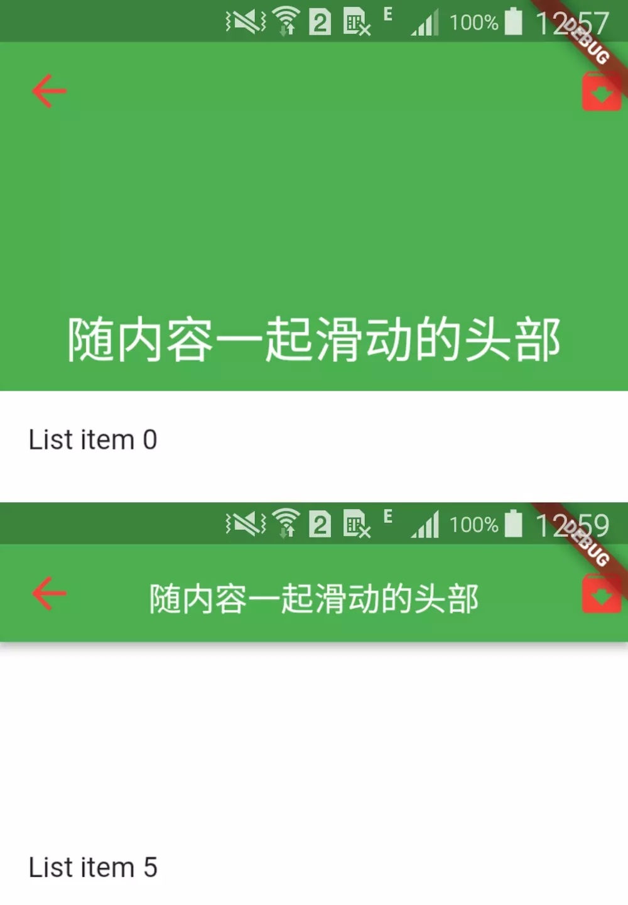

## ScrollView（滚动视图）
[ScrollView](https://docs.flutter.io/flutter/widgets/ScrollView-class.html) 是一个带有滚动的视图组件。

ScrollView 由三部分组成：
- Scrollable - 它监听各种用户手势并实现滚动的交互设计。
- Viewport - 它通过在滚动视图内仅显示一部分小部件来实现滚动的可视化设计。
- Slider - 它们是可以组合以创建各种滚动效果的小部件，如列表，网格和扩展标题。

ScrollView 有以下常用属性：
- **cacheExtent → double** - 视口在可见区域之前和之后有一个区域，用于缓存用户滚动时即将可见的项目。
- **controller → ScrollController** - 一个可用于控制滚动视图滚动到的位置的对象。
- **physics → ScrollPhysics** - 滚动视图应如何响应用户输入。
- **primary → bool** - 是否是与父级关联的主滚动视图。
- **reverse → bool** - 滚动视图是否在阅读方向上滚动。
- **scrollDirection → Axis** - 滚动视图滚动的轴。
- **shrinkWrap → bool** - 应该根据正在查看的内容确定滚动视图的范围。

注：ScrollView 是一个抽象类，通常使用 CustomScrollView。

```js
new CustomScrollView(
    shrinkWrap: true,
    // 内容
    slivers: <Widget>[
        new SliverPadding(
            padding: const EdgeInsets.all(20.0),
            sliver: new SliverList(
                delegate: new SliverChildListDelegate(
                    <Widget>[
                        const Text('A'),
                        const Text('B'),
                        const Text('C'),
                        const Text('D'),
                    ],
                ),
            ),
        ),
    ],
)
```

### SliverAppBar
SliverAppBar 可以实现背景，标题，顶部导航栏联动，渐隐渐出动画。



SliverAppBar 有以下常用属性：
- **pinned → bool** - 向上滑动之后是否固定导航栏。
- **floating → bool** - 向上滑动之后隐藏标题。
- **expandedHeight → double** - 可滚动视图的高度。
- **titleSpacing → double** - 标题两边的空白区域。
- **primary → bool** - 是否显示在最上面。
- **forceElevated → bool** - 是否显示阴影。
- **centerTitle → bool** - 标题是否居中。
- **textTheme → TextTheme** - 字体样式。
- **iconTheme → IconTheme** - 图标样式。
- **brightness → double** - 状态栏高度。
- **automaticallyImplyLeading → double** - 与 leading 相关的设置，决定没有 leading 时是否显示空白。
- **elevation → double** - 阴影的高度。
- **backgroundColor → Color** - 阴影颜色。
- **flexibleSpace → FlexibleSpace** - 堆叠在工具栏和标签栏后面。
- **leading → Leading** - 表示左侧的按钮的动作。
- **actions → Widget[]** - 表示右侧的按钮的动作。
- **title → String | Widget** - 标题。
- **bottom → Widget** - 底部的内容。

```js
new CustomScrollView(
    slivers: <Widget>[
        SliverAppBar(
            leading: GestureDetector(
                child: Icon(Icons.arrow_back),
                onTap: () => Navigator.pop(context),
            ),
            automaticallyImplyLeading: true,
            centerTitle: true,
            actions: [Icon(Icons.archive)],
            elevation: 4,
            forceElevated: false,
            backgroundColor: Colors.green,
            brightness: Brightness.dark,
            primary: true,
            titleSpacing: 16,
            expandedHeight: 200.0,
            floating: false,
            pinned: true,
            snap: false,
            flexibleSpace: new FlexibleSpaceBar(
                title: new Text('随内容一起滑动的头部'),
                centerTitle: true,
                collapseMode: CollapseMode.pin,
            ),
        ),
        // 这里是列表
        new SliverFixedExtentList(
            itemExtent: 150.0,
            delegate: new SliverChildBuilderDelegate(
                (context, index) => new ListTile(
                    title: new Text('List item $index'),
                ),
            ),
        )
    ],
),
```

> 由于 title 可以是自定义的 Widget，因此可以使用 SliverAppBar + TabView 可以实现吸顶，悬浮的 Tab 效果。