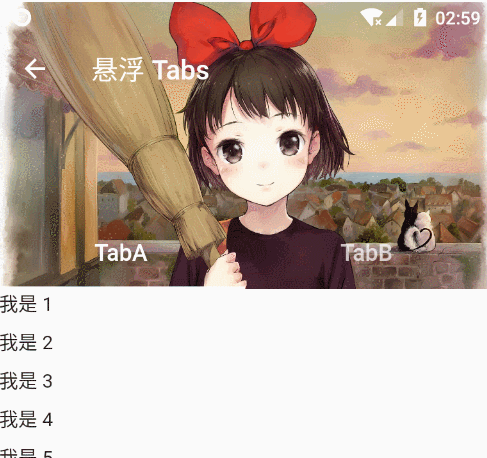

## Tabs（标签栏）
Tabs 一般用于展现多个页面的内容的容器，例如微信的下面标签栏。

常用的组件有：TabBar、TabBarView、TabController（有状态）、DefaultTabController（无状态）、BottomNavigationBar（底端栏）。


在 Tabs 里，使用到了动画效果，因此需要 with 一个类。

```js
// 之前
class HomePageState extends State<HomePage> {
    // ...
}
// 使用 Tabs 之后
class HomePageState extends State<HomePage> with SingleTickerProviderStateMixin {
    // ...
}
```

接着，在 HomePageState 里初始化 Tabs Controller，这里重写了两个生命周期函数。

```js
class HomePageState extends State<HomePage> with SingleTickerProviderStateMixin {
  var tabController;      // 先声明变量

  @override
  void initState() {
    super.initState();
    this.tabController = new TabController(
      vsync: this,    // 动画效果的异步处理
      length: 3       // tab 个数
    );
  }
  // 当整个页面 dispose 时，记得把控制器也 dispose 掉，释放内存
  @override
  void dispose() {
    this.tabController .dispose();
    super.dispose();
  }
}
```

接着，添加 TabBar 和 TabBarView。

```js
Widget build(BuildContext context) {
  return Scaffold(
    appBar: AppBar(
      title: Text('首页'),
    ),
    body: TabBarView(
      controller: this.tabController, //配置控制器
      children: [ // Tab 内容
        Text('aaa'),
        Text('bbb'),
        Text('ccc'),
      ],
    ),
    // 底端栏是一个 TabBar
    bottomNavigationBar: Material(
      color: Colors.blue,
      child: TabBar(
        controller: this.tabController,
        indicatorColor: Colors.white,
        tabs: <Tab>[
          Tab(text: '主页', icon: Icon(Icons.home)),
          Tab(text: '历史', icon: Icon(Icons.history)),
          Tab(text: '书籍', icon: Icon(Icons.book)),
        ],
      ),
    )
  );
}
```

可以看到，在 TabBar 里是设置控制栏的内容，在 TabBarView 里是设置每个 Tab 的内容。而 TabController 是一个用于控制的组件。
TabBar 与 TabBarView 的数组位置一一对应。


### TabBar
[TabBar](https://docs.flutter.io/flutter/material/TabBar-class.html)  是用于显示 Tab 的菜单信息的。

在 TabBar 里有以下常用属性：
- **controller → TabController** - 控制组件。
- **tabs → List<Widget>** - tabs 列表。
- **indicatorColor → Color** - 指示线颜色，就是下面的线条。使用 Colors.transparent 可以让它消失。
- **unselectedLabelColor → Color** - 未选定标签标签的颜色。
- **unselectedLabelStyle → TextStyle** - 未选定标签标签的文字样式。
- **labelStyle → TextStyle** - 字体样式。
- **labelColor → Color** - 字体颜色，默认白色。
- **isScrollable → bool** - 该标签栏是否可以水平滚动，默认 false。在多个 tab 时有用。
- **indicatorWeight → double** - 指示线的大小，必须大于 0。
- **indicatorSize → TabBarIndicatorSize** - 所选标签指标的大小，当为 Tab 时会尽可能大，当为 Label 时会尽可能小。
- **indicatorPadding → EdgeInsetsGeometry** - 显示在选定选项卡下方的线的水平填充。


**TabBar 没有可以用于设置选中项样式的属性。**那么想设置选中的样式怎么弄？可以利用未选中来排除。

```js
 bottomNavigationBar: new Material(
  color: Colors.white,
  child: new TabBar(
    controller: this.tabController,
    unselectedLabelColor: Colors.black38, // <-- 一定要在 labelColor 前面。
    labelColor: Colors.blue,
    indicatorColor: Colors.blue,
    tabs: <Tab>[],
  ),
);
```

把 TabBar 放在顶端，通过 appBar 的 title 设置。

```js
appBar: AppBar(
  title: Material(                            // <-- 放在这里
    color: Colors.blue,
    child: TabBar(
      controller: this.tabController,
      indicatorColor: Colors.transparent,
      unselectedLabelColor: Colors.blue[200],
      labelColor: Colors.white,
      tabs: <Tab>[
        Tab(text: '主页'),
        Tab(text: '历史'),
        Tab(text: '书籍'),
      ],
    ),
  ),
),
```


还可以放在 bottom 处，形成一种双栏效果。

```js
appBar: AppBar(
  title: Icon(Icons.menu),
  bottom: TabBar(
    controller: this.tabController,
    indicatorColor: Colors.transparent,
    unselectedLabelColor: Colors.blue[200],
    labelColor: Colors.white,
    tabs: <Tab>[
      Tab(text: '主页'),
      Tab(text: '历史'),
      Tab(text: '书籍'),
    ],
  )
),
```


### TabBarView
[TabBarView](https://docs.flutter.io/flutter/material/TabBarView-class.html) 就是用来展示每个 Tab 的内容的，在 TabBarView 的数组里与 TabBar 的数组一一映射。

TabBarView 有以下常用属性：
- **children → List<Widget>** - Tab 内容列表。
- **controller → TabController** - Tab 控制器。
- **physics → ScrollPhysics** - 页面视图如何响应用户输入。

### TabController
[TabController](https://docs.flutter.io/flutter/material/TabController-class.html) 是 Tab 页的控制器，用于定义 Tab 标签和内容页的坐标，还可配置标签页的切换动画效果等。

TabController 一般放入有状态控件中使用，以适应标**签页数量**和内**容有动态变化**的场景，如果标签页在 App 中是静态固定的格局，则可以在无状态控件中加入简易版的 DefaultTabController 以提高运行效率，毕竟无状态控件要比有状态控件更省资源，运行效率更快。

TabController 的使用方式非常直白，它作为 TabBar 和 TabBarView 的控制器使用存在。

```js
class HomePageState extends State<HomePage> with SingleTickerProviderStateMixin {
  var tabController;      // 先声明变量

  @override
  void initState() {
    super.initState();
    this.tabController = new TabController(
      vsync: this,        // 动画效果的异步处理
      length: 3           // tab 个数
      initialIndex: 0,    // 起始位置
    );
  }
  // 当整个页面 dispose 时，记得把控制器也 dispose 掉，释放内存
  @override
  void dispose() {
    this.tabController.dispose();
    super.dispose();
  }
}
```

常用的方法和属性：
- **animateTo(int index)** - 滑动到某个 tab 页。
- **offset(double val)** - 获取/设置当前 tab 的偏移量（从第一个开始算） 。
- **dispose()** - 释放当前 tabController。
- **addListener()** - 监听器。
- **indexIsChanging → bool** - 返回 tab index 是否已经改变了。

```js
new FlatButton(
  child: new Text('点我'),
  onPressed: () {
    this.tabController.animateTo(0);
    print(this.tabController.offset());
  },
),
```

那么一般当 tab 索引改变时，会做一些处理，比如网络请求什么的，在这里怎么判断？使用 addListener。

```js
@override
void initState() {
  super.initState();
  this.tabController = new TabController(vsync: this, length: 3);
  this.tabController.addListener(() {
    if (this.tabController.indexIsChanging) {
      print('索引改变');
    }
  });
}
```

### BottomNavigationBar
也可以单独使用 BottomNavigationBar，不过这时候要自己设置页面的渲染内容。

```js
class Index extends StatefulWidget {
  @override
  State<Index> createState() => new _IndexState();
}

class NavItem {
  NavItem({this.icon, this.title});

  Icon icon;
  String title;
}

class NavigationIconView {
  NavigationIconView({
    Widget icon,
    Widget title,
    TickerProvider vsync,
  })  : item = new BottomNavigationBarItem(icon: icon, title: title),
        controller = new AnimationController(
          duration: kThemeAnimationDuration,
          vsync: vsync,
        );

  final BottomNavigationBarItem item;
  final AnimationController controller;
}

class _IndexState extends State<Index> with TickerProviderStateMixin {
  // 激活的页面索引
  int currentIndex = 0;
  List<NavigationIconView> navViews;
  // 菜单列表
  List<NavItem> navList = [
    NavItem(icon: Icon(Icons.assignment), title: '首页'),
    NavItem(icon: Icon(Icons.all_inclusive), title: '想法'),
    NavItem(icon: Icon(Icons.add_shopping_cart), title: '市场'),
    NavItem(icon: Icon(Icons.add_alert), title: '通知'),
    NavItem(icon: Icon(Icons.perm_identity), title: '我的'),
  ];
  // 页面列表
  List pageList = [
    new HomePage(),
    new IdeaPage(),
    new MarketPage(),
    new NoticePage(),
    new MyPage(),
  ];

  @override
  void initState() {
    super.initState();
    // 初始化菜单栏列表，添加一些动画效果
    navViews = navList.map(
      (v) => NavigationIconView(
            icon: v.icon,
            title: Text(v.title),
            vsync: this,
          ),
    ).toList();
  }

  @override
  Widget build(BuildContext context) {
    // BottomNavigationBar
    var navBar = new BottomNavigationBar(
      items: navViews.map((NavigationIconView v) => v.item).toList(),
      currentIndex: currentIndex,
      fixedColor: Colors.blue,
      type: BottomNavigationBarType.fixed,
      onTap: (int index) => setState(() => currentIndex = index),
    );

    return new MaterialApp(
      home: new Scaffold(
        // 这样写有一个问题，相当于重新渲染，不会记录滚动条的位置
        body: new Center(child: pageList[currentIndex]),
        bottomNavigationBar: navBar,
      ),
    );
  }
}
```


## 悬浮（吸顶）Tabs
悬浮（吸顶）Tabs 这个功能也是比较常用的，这里就记录一下怎么实现。



```js
class NestedScrollDemoPage extends StatelessWidget {
  final _tabs = <String>['TabA', 'TabB'];
  final String img = 'http://pic1.win4000.com/wallpaper/1/5601176e8001b.jpg';

  @override
  Widget build(BuildContext context) {
    var getHandle = (context) => NestedScrollView.sliverOverlapAbsorberHandleFor(context);
    var flexibleSpace = FlexibleSpaceBar(background: Image.network(img, fit: BoxFit.cover));

    return Scaffold(
      body: DefaultTabController(
        length: _tabs.length,
        child: NestedScrollView(
          headerSliverBuilder: (context, innerScrolled) => [
            SliverOverlapAbsorber(
              handle: getHandle(context),
              child: SliverAppBar(
                pinned: true,
                title: Text('悬浮 Tabs'),
                expandedHeight: 200.0,
                flexibleSpace: flexibleSpace,
                bottom: TabBar(
                  tabs: _tabs.map((tab) {
                    return Container(
                      padding: EdgeInsets.all(16),
                      child: Text(tab, style: TextStyle(fontSize: 18.0)),
                    );
                  }).toList(),
                ),
                forceElevated: innerScrolled,
              ),
            ),
          ],
          body: TabBarView(
            children: _tabs.map((tab) {
              return Builder(builder: (context) {
                return CustomScrollView(
                  // key 保证唯一性
                  key: PageStorageKey<String>(tab),
                  slivers: <Widget>[
                    // 将子部件同 `SliverAppBar` 重叠部分顶出来，否则会被遮挡
                    SliverOverlapInjector(handle: getHandle(context)),
                    SliverFixedExtentList(
                      delegate: SliverChildBuilderDelegate(
                        (_, index) => Container(child: Text('我是 ${index + 1}')),
                        childCount: 30,
                      ),
                      itemExtent: 30.0,
                    ),
                  ],
                );
              });
            }).toList(),
          ),
        ),
      ),
    );
  }
}
```